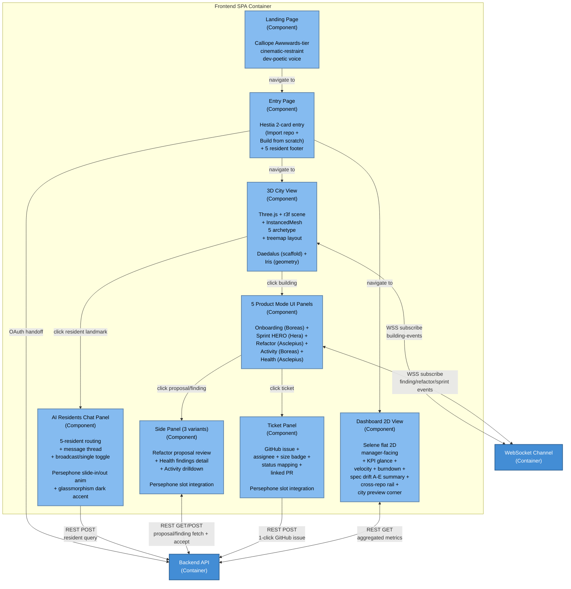
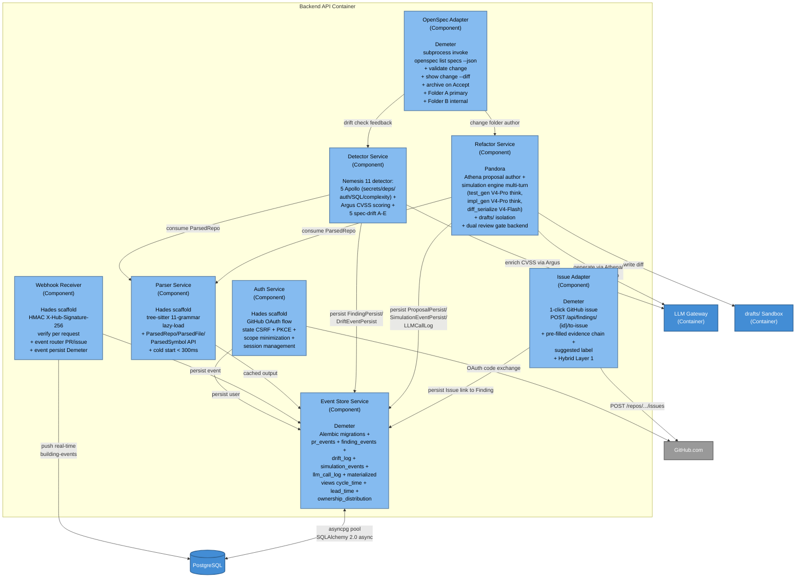
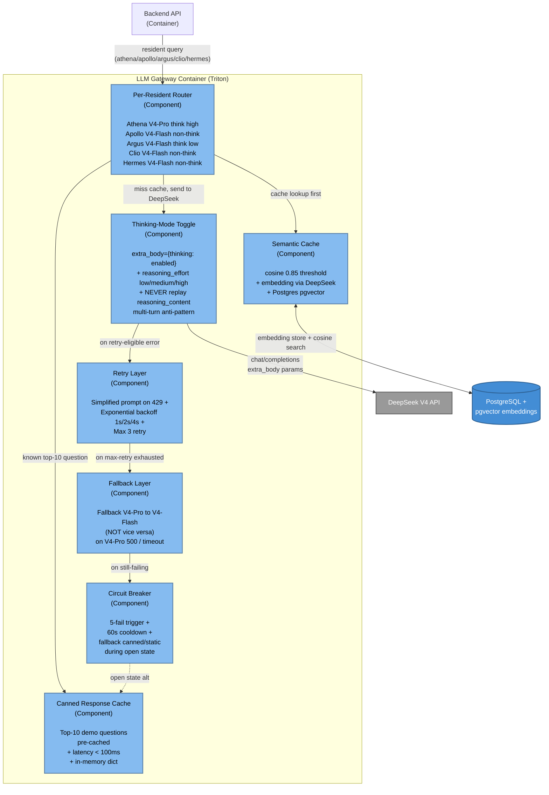

# C4 Level 3: Component Diagram (Codeplex Chronicle)

**Diagram type**: C4 Level 3 (Component)
**Purpose**: Decompose Frontend SPA + Backend API + LLM Gateway containers into components with mode-specific responsibility
**Audience**: Wave 1-3 implementer + Aletheia final audit + Refactory judge technical review
**Source**: PRD Section 9 Functional Requirements per Mode + Metis md Section 3 Roster + `_meta/contracts/_master_index.md`
**Authored by**: Themis Wave 0
**Date**: 2026-05-12 17:00 WIB

## Frontend SPA components



## Backend API components



## LLM Gateway components (Triton defensive layer)



## Component summary table

### Frontend SPA components

| Component | Owner (worker) | Wave | Source contract |
|---|---|---|---|
| 3D City View | Daedalus (scaffold) + Iris (geometry) | 1 | daedalus-to-iris.md |
| 5 Product Mode UI Panels | Hera (Sprint) + Asclepius (Health+Refactor) + Boreas (Onboarding+Activity) | 2 | iris-to-hera.md + hera-to-persephone.md + asclepius-to-pandora.md + boreas-to-triton.md |
| AI Residents Chat Panel | Persephone | 2 | persephone-to-triton.md + calliope-to-wave2-panels.md |
| Ticket Panel | Persephone | 2 | hera-to-persephone.md + selene-to-persephone.md |
| Side Panel (3 variants) | Persephone | 2 | asclepius-to-pandora.md + asclepius-to-triton.md |
| Dashboard 2D View | Selene | 1 | claude-design-bundle-to-selene.md + selene-to-demeter.md |
| Landing Page | Calliope | 1 | claude-design-bundle-to-calliope.md |
| Entry Page | Hestia | 1 | claude-design-bundle-to-hestia.md + hestia-to-hades.md |

### Backend API components

| Component | Owner (worker) | Wave | Source contract |
|---|---|---|---|
| Auth Service | Hades | 3 | hestia-to-hades.md |
| Webhook Receiver | Hades | 3 | hera-to-hades.md |
| Parser Service | Hades | 3 | hades-to-nemesis.md + hades-to-pandora.md |
| Detector Service | Nemesis | 3 | hades-to-nemesis.md + triton-to-nemesis.md + nemesis-to-demeter.md + nemesis-to-asclepius.md |
| Refactor Service | Pandora | 3 | hades-to-pandora.md + triton-to-pandora.md + pandora-to-demeter.md + pandora-to-asclepius.md |
| OpenSpec Adapter | Demeter | 3 | (subprocess wrapper, no contract) |
| Event Store Service | Demeter | 3 | hades-to-demeter.md + nemesis-to-demeter.md + pandora-to-demeter.md + selene-to-demeter.md + boreas-to-demeter.md + demeter-to-selene.md + demeter-to-boreas.md |
| Issue Adapter | Demeter (Hybrid Layer 1) | 3 | nemesis-to-demeter.md (FindingPersist) |

### LLM Gateway components (Triton)

| Component | Owner (worker) | Wave | Source contract |
|---|---|---|---|
| Per-Resident Router | Triton | 3 | triton-to-residents.md + triton-to-nemesis.md + triton-to-pandora.md |
| Semantic Cache | Triton | 3 | (internal to LLM gateway, no cross-worker contract) |
| Canned Response Cache | Triton | 3 | (internal, top-10 demo question lookup) |
| Retry Layer | Triton | 3 | (internal) |
| Fallback Layer | Triton | 3 | (internal) |
| Circuit Breaker | Triton | 3 | (internal) |
| Thinking-Mode Toggle | Triton | 3 | triton-to-residents.md (per-resident toggle config) |

## Key behavior

### Drop-first feature flag order (per Phase B H1)

If 60fps regress on M-series MBP 16GB + 200-300 building:
1. `ENABLE_DOF=false` (DepthOfField post-processing)
2. Pixel ratio 2.0 to 1.5
3. `ENABLE_SPARKLES_TIER_3=false`
4. `ENABLE_THIRD_DIRECTIONAL_LIGHT=false`

Daedalus listener: `state.performance.regress()` on `OrbitControls.onChange`.

### drafts/ isolation (AD-19 LOCKED)

```
User intent (chat) -> Athena V4-Pro think high -> proposal.md/design.md/tasks.md authored in openspec/changes/<change-name>/
   |
   v
Pandora simulation engine multi-turn:
   Turn 1 (test_gen V4-Pro think high)
   Turn 2 (impl_gen V4-Pro think high)  
   Turn 3 (diff_serialize V4-Flash non-think)
   |
   v
Write to drafts/<simulation-id>/ ONLY  
(production code NEVER touched per AD-19 LOCKED safety property)
   |
   v
Asclepius ghost-to-solid animation (frontend visual)
   |
   v
User Accept (dual review gate UI) -> create real diff via GitHub PR / patch
       OR
       Discard -> drafts/<simulation-id>/ deleted, no production change
```

### Per-resident routing (Triton)

```
Resident query -> Router determines model + thinking-mode:
   Athena -> V4-Pro thinking_high  (Refactor proposal author)
   Apollo -> V4-Flash non-thinking  (Health narration)
   Argus -> V4-Flash thinking_low  (Security CVSS scoring)
   Clio -> V4-Flash non-thinking  (Git/spec-drift narration)
   Hermes -> V4-Flash non-thinking  (Tour script)

   Refactor sim multi-turn -> V4-Pro thinking_high (Turn 1-2) + V4-Flash (Turn 3 diff serialize)
   Defensive layer applied at every call:
       semantic cache (cosine 0.85 hit) -> early return
       canned response (top-10 match) -> early return < 100ms
       call DeepSeek with thinking-mode toggle
       on error: retry simplified -> fallback V4-Flash -> circuit breaker -> canned
```

## Cross-references

- PRD Section 9 Functional Requirements per Mode
- PRD Section 18 DeepSeek V4 Integration (Section 18.3 model selection strategy)
- `_meta/contracts/_master_index.md` (per-component handoff schemas)
- `_meta/roster.md` (worker domain ownership)
- C4-Container.md (Level 2 parent containers)
- C4-Context.md (Level 1 system boundary)

---

**Diagram authored**: 2026-05-12 17:00 WIB by Themis Wave 0
**SVG export**: `docs/c4/C4-Component.svg`
**Mirror in PanitSubmission/**: `PanitSubmission/c4/C4-Component.{md,svg}`
