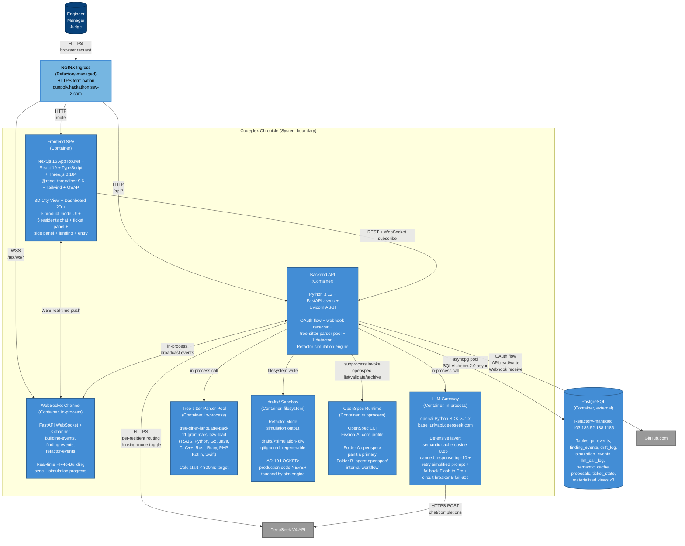

# C4 Level 2: Container Diagram (Codeplex Chronicle)

**Diagram type**: C4 Level 2 (Container)
**Purpose**: Decompose Codeplex Chronicle into deployable containers + show inter-container communication
**Audience**: Refactory judge + new engineer + Wave 3 backend implementer
**Source**: PRD Section 8.2 Container Diagram + PRD Section 17 Tech Stack + Metis md Section 3 Roster
**Authored by**: Themis Wave 0
**Date**: 2026-05-12 16:55 WIB

## Legend

- **Container icon (filled blue rectangle)**: deployable container in Codeplex Chronicle system
- **Database icon (cylinder)**: persistent storage
- **External icon (gray)**: external system
- **CDN/Ingress icon (light blue)**: edge proxy
- **Solid arrow with label**: synchronous interaction (protocol)

## Container summary table

| Container | Tech | Wave 3 Owner | Responsibility |
|---|---|---|---|
| **Frontend SPA** | Next.js 16 + React 19 + Three.js + r3f | Wave 1 (Daedalus + Iris + Calliope + Hestia + Selene) + Wave 2 (Hera + Asclepius + Boreas + Persephone) | 3D City + Dashboard + 5 mode UI + chat/ticket/side panels |
| **Backend API** | Python 3.12 + FastAPI async | Hades (scaffold + OAuth + webhook + WS) | OAuth flow, webhook receiver, parser + detector + simulation orchestration |
| **WebSocket Channel** | FastAPI WebSocket, 3 channels | Hades (setup) + Pandora/Nemesis (publish) + Asclepius/Hera (consume) | Real-time PR-to-Building sync + finding events + refactor events |
| **LLM Gateway** | openai SDK >=1.x + defensive layer | Triton (Wave 3) | Per-resident routing + thinking-mode toggle + cache + retry + fallback + circuit breaker |
| **Tree-sitter Parser Pool** | tree-sitter-language-pack, 11 grammars | Hades (parser API) + cached output Day-0 prep | Lazy-load multi-language AST parsing, cold start < 300ms |
| **drafts/ Sandbox** | Filesystem (gitignored, regenerable) | Pandora (simulation engine writes here) | AD-19 LOCKED isolation: production never touched, only Accept materializes diff |
| **OpenSpec Runtime** | OpenSpec CLI subprocess + Fission-AI core | Demeter (runtime integration) + Pandora (change folder generator) | spec data via JSON, change folder author, drift detection, archive |
| **PostgreSQL** | PostgreSQL 16 (Refactory-managed) | Demeter (Wave 3) schema + migrations + queries | Event store + cache + ticket state + materialized views |

## Communication protocols

| Edge | Protocol | Schema |
|---|---|---|
| User → Ingress | HTTPS (TLS 1.3) | HTML / JSON |
| Ingress → SPA | HTTP | Static assets + HTML |
| Ingress → API | HTTP | REST JSON |
| Ingress → WS | WSS (WebSocket Secure) | JSON message |
| SPA → API | REST JSON | Pydantic-defined API contracts per `_meta/contracts/<edge>.md` |
| SPA ↔ WS | WSS bidirectional | TypeScript types per `_meta/contracts/<edge>.md` |
| API → GitHub | HTTPS REST + webhook (HMAC signed) | GitHub API v2022-11-28 |
| API → DeepSeek | HTTPS REST | OpenAI ChatCompletions compat |
| API ↔ Postgres | TCP (asyncpg) | SQL + SQLAlchemy 2.0 async ORM |
| API → OpenSpec | subprocess stdout/stderr | OpenSpec JSON output |
| API → drafts/ | filesystem write | Unified diff format files |

## Critical architecture decisions reflected

| Decision | Container affected | Visual |
|---|---|---|
| AD-01 monolith Next.js + FastAPI | Frontend SPA + Backend API | Single block per side, no microservice split |
| AD-04 OpenSpec dual-folder | OpenSpec Runtime + Backend API | Folder A and Folder B both visible in OpenSpec Runtime annotation |
| AD-06 DeepSeek per-resident routing | LLM Gateway | Defensive layer annotation explicit |
| AD-08 drafts/ isolation safety | drafts/ Sandbox + Backend API | AD-19 LOCKED annotation explicit |
| AD-10 tree-sitter lazy-load 11 grammars | Tree-sitter Parser Pool | 11 grammars listed + cold start budget annotation |

## Cross-references

- PRD Section 8.2 (C2 Container Diagram table)
- PRD Section 17 (Tech Stack locked)
- PRD Section 8.3 (Key architectural decisions AD-01 to AD-10)
- `_meta/contracts/_master_index.md` (per-container handoff schemas)
- C4-Component.md (Level 3 decomposition of Frontend SPA + Backend API)

---

**Diagram authored**: 2026-05-12 16:55 WIB by Themis Wave 0
**SVG export**: `docs/c4/C4-Container.svg`
**Mirror in PanitSubmission/**: `PanitSubmission/c4/C4-Container.{md,svg}`
