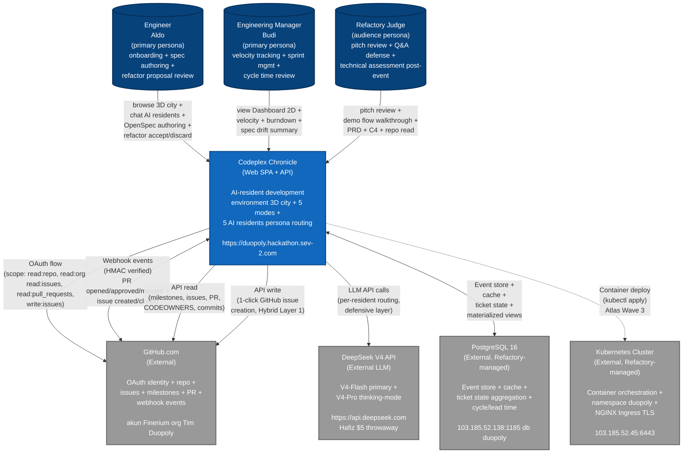

# C4 Level 1: System Context (Codeplex Chronicle)

**Diagram type**: C4 Level 1 (System Context)
**Purpose**: Show how Codeplex Chronicle fits in its environment (users + external systems)
**Audience**: Refactory judge + new engineer onboarding the project
**Source**: PRD Section 8.1 + sourceoftruth Section 1-3 + Metis md Section 1 Project Recap
**Authored by**: Themis Wave 0 (project-local setup smith)
**Date**: 2026-05-12 16:50 WIB

## Legend

- **Solid arrow**: synchronous interaction (HTTP request / response, DB query)
- **Bidirectional arrow**: bidirectional communication (webhook + API + DB write)
- **Dashed arrow**: build-time / deploy-time interaction (not runtime data flow)
- **Person icon (filled top circle)**: human persona
- **Rounded rectangle (filled)**: internal software system (Codeplex Chronicle)
- **Rectangle (filled gray)**: external software system

## Description

Codeplex Chronicle is an AI-resident development environment that transforms production codebases into navigable 3D cities. Users include engineers (onboarding + refactor proposal review), engineering managers (velocity tracking + sprint management), and Refactory judges (pitch + technical assessment).

External system integrations:
- **GitHub** for source-of-truth ticket management (OAuth + API + webhooks)
- **DeepSeek V4** for LLM inference (5 resident persona routing, per-resident model + thinking-mode)
- **PostgreSQL** (Refactory pre-provisioned) for event store + cache + ticket state aggregation
- **Kubernetes** (Refactory pre-provisioned) for container orchestration + NGINX Ingress TLS

The system runs at https://duopoly.hackathon.sev-2.com (Refactory-pre-provisioned domain). All credentials live in `~/Documents/codeplexRefactory/.env` mode 600 (gitignored).

## Trust boundary

| Boundary | Inside (trusted) | Outside (untrusted) |
|---|---|---|
| Codeplex Chronicle internal | Backend FastAPI + Frontend SPA + LLM client + DB session | Browser user input, GitHub webhook payload, DeepSeek API response |
| GitHub OAuth scope | Read:repo + read:org + read:issues + read:pull_requests + write:issues | Repo write code, admin:org, admin:repo_hook, delete_repo, user:email |
| Refactory K8s namespace | `duopoly` pod + service + ingress | Other Refactory tenant namespace |
| `drafts/` sandbox | Refactor Mode simulation engine writes here ONLY | Production code never touched by simulation (AD-19 LOCKED) |

## Cross-references

- PRD Section 8.1 (C1 System Context ASCII sketch)
- PRD Section 19 (Security boundaries)
- sourceoftruth Section 3 (Credentials state)
- `_meta/contracts/_master_index.md` (33 contracts documenting internal handoffs)

---

**Diagram authored**: 2026-05-12 16:50 WIB by Themis Wave 0
**SVG export**: `docs/c4/C4-Context.svg` via `mmdc -i docs/c4/C4-Context.md -o docs/c4/C4-Context.svg`
**Mirror in PanitSubmission/**: `PanitSubmission/c4/C4-Context.{md,svg}`
