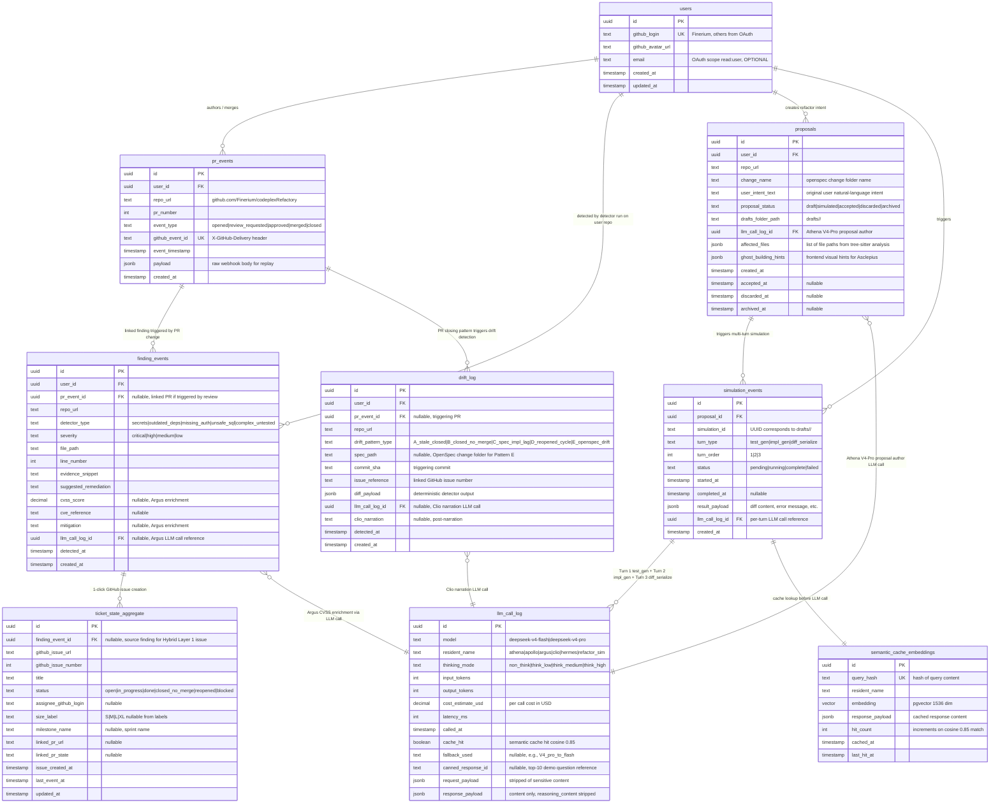

# ERD: PostgreSQL Event Store (Codeplex Chronicle)

**Diagram type**: Entity Relationship Diagram (ERD)
**Purpose**: Document PostgreSQL event store schema + materialized views for Refactory-managed Postgres instance
**Audience**: Refactory judge + Wave 3 Demeter (schema author) + Aletheia (final audit)
**Source**: PRD Section 18.7 + Pythia contracts (hades-to-demeter.md, nemesis-to-demeter.md, pandora-to-demeter.md, selene-to-demeter.md, boreas-to-demeter.md) + Demeter Wave 3 worker prompt
**Authored by**: Themis Wave 0 (seed, Demeter Wave 3 refines, Aletheia final audit confirms)
**Date**: 2026-05-12 17:10 WIB

**Database**: `duopoly` at `103.185.52.138:1185` (Refactory pre-provisioned)
**Migrations**: Alembic-managed by Demeter Wave 3, target 5 migrations (001 base + 002 detector + 003 refactor + 004 + 005 materialized views)



## Materialized views (auto-refreshed via Demeter)

Materialized views are not in the ER diagram but documented as derived tables computed from base event store:

| View | Source tables | Refresh schedule | Used by |
|---|---|---|---|
| **cycle_time_aggregate** | pr_events + ticket_state_aggregate | every 5 min | Selene Dashboard burndown + cycle time chart |
| **lead_time_aggregate** | pr_events + ticket_state_aggregate | every 5 min | Selene Dashboard lead time + velocity chart |
| **ownership_distribution** | pr_events + users + CODEOWNERS parse | hourly | Boreas Activity heatmap + Selene Dashboard contributor analytics |

### Cycle time aggregate SQL hint

```sql
CREATE MATERIALIZED VIEW cycle_time_aggregate AS
SELECT
    ticket.id AS ticket_id,
    ticket.milestone_name,
    ticket.size_label,
    EXTRACT(EPOCH FROM (ticket.last_event_at - ticket.issue_created_at)) / 86400 AS cycle_days
FROM ticket_state_aggregate ticket
WHERE ticket.status IN ('done', 'closed_no_merge', 'merged')
WITH DATA;

CREATE UNIQUE INDEX ON cycle_time_aggregate (ticket_id);
```

### Lead time aggregate SQL hint

```sql
CREATE MATERIALIZED VIEW lead_time_aggregate AS
SELECT
    pr.id AS pr_id,
    pr.repo_url,
    pr.pr_number,
    MIN(pr.event_timestamp) FILTER (WHERE pr.event_type = 'opened') AS pr_opened_at,
    MAX(pr.event_timestamp) FILTER (WHERE pr.event_type = 'merged') AS pr_merged_at,
    EXTRACT(EPOCH FROM (MAX(pr.event_timestamp) FILTER (WHERE pr.event_type = 'merged')
                       - MIN(pr.event_timestamp) FILTER (WHERE pr.event_type = 'opened'))) / 86400
        AS lead_days
FROM pr_events pr
GROUP BY pr.id, pr.repo_url, pr.pr_number
WITH DATA;
```

### Ownership distribution SQL hint

```sql
CREATE MATERIALIZED VIEW ownership_distribution AS
SELECT
    user.github_login,
    pr.repo_url,
    SPLIT_PART(jsonb_array_elements_text(pr.payload->'commits'->0->'modified'), '/', 1) AS district,
    COUNT(*) AS commit_count,
    SUM((pr.payload->'commits'->0->>'additions')::int) AS lines_added,
    SUM((pr.payload->'commits'->0->>'deletions')::int) AS lines_deleted
FROM pr_events pr
INNER JOIN users user ON pr.user_id = user.id
WHERE pr.event_type = 'merged'
  AND pr.event_timestamp > NOW() - INTERVAL '90 days'
GROUP BY user.github_login, pr.repo_url, district
WITH DATA;
```

## Foreign key relationships summary

| From | To | Cardinality | Purpose |
|---|---|---|---|
| pr_events | users | many to one | PR author or merger |
| finding_events | users | many to one | Detector run by which user session |
| finding_events | pr_events | many to one (nullable) | Linked PR triggering finding |
| finding_events | llm_call_log | many to one (nullable) | Argus CVSS enrichment LLM call |
| finding_events | ticket_state_aggregate | one to many | 1-click GitHub issue creation Hybrid Layer 1 |
| drift_log | users | many to one | Detector run user |
| drift_log | pr_events | many to one (nullable) | Triggering PR for Pattern A/D drift |
| drift_log | llm_call_log | many to one (nullable) | Clio narration LLM call |
| proposals | users | many to one | Refactor intent author |
| proposals | llm_call_log | many to one | Athena V4-Pro proposal author |
| simulation_events | proposals | many to one | Multi-turn simulation per proposal |
| simulation_events | llm_call_log | many to one | Per-turn LLM call |
| simulation_events | semantic_cache_embeddings | many to one | Cache lookup before LLM call |
| ticket_state_aggregate | finding_events | one to one (nullable) | Source finding for Hybrid Layer 1 issue |

## Indexes (performance hints)

```sql
-- Frequently queried lookups
CREATE INDEX idx_pr_events_repo_url ON pr_events(repo_url);
CREATE INDEX idx_pr_events_event_timestamp ON pr_events(event_timestamp DESC);
CREATE INDEX idx_finding_events_severity ON finding_events(severity);
CREATE INDEX idx_finding_events_detector_type ON finding_events(detector_type);
CREATE INDEX idx_drift_log_drift_pattern_type ON drift_log(drift_pattern_type);
CREATE INDEX idx_proposals_proposal_status ON proposals(proposal_status);
CREATE INDEX idx_simulation_events_simulation_id ON simulation_events(simulation_id);
CREATE INDEX idx_llm_call_log_called_at ON llm_call_log(called_at DESC);
CREATE INDEX idx_llm_call_log_cost_tracking ON llm_call_log(model, called_at DESC) INCLUDE (cost_estimate_usd);

-- pgvector cosine similarity for semantic cache
CREATE INDEX idx_semantic_cache_embeddings_cosine ON semantic_cache_embeddings
    USING ivfflat (embedding vector_cosine_ops) WITH (lists = 100);
```

## Migration order (Demeter Wave 3)

| Migration | Tables | Purpose |
|---|---|---|
| 001_base | users + pr_events | OAuth + webhook event ingestion |
| 002_detector | finding_events + drift_log | Nemesis detector output |
| 003_refactor | proposals + simulation_events + llm_call_log + semantic_cache_embeddings | Pandora simulation + Triton LLM tracking |
| 004_aggregate | ticket_state_aggregate | Hybrid Layer 1 issue creation |
| 005_views | cycle_time_aggregate + lead_time_aggregate + ownership_distribution | Materialized views for Selene Dashboard + Boreas Activity Mode |

## Cross-references

- PRD Section 18.7 Cost Tracking (`llm_call_log` schema authoritative source)
- `_meta/contracts/hades-to-demeter.md` (users + pr_events schema)
- `_meta/contracts/nemesis-to-demeter.md` (finding_events + drift_log schema)
- `_meta/contracts/pandora-to-demeter.md` (proposals + simulation_events + llm_call_log schema)
- `_meta/contracts/selene-to-demeter.md` (Dashboard query consume cycle_time + lead_time + ownership_distribution)
- `_meta/contracts/demeter-to-selene.md` (feedback materialized view SQL)
- `_meta/contracts/boreas-to-demeter.md` (Activity Mode event-store query)
- `.claude/agents/demeter.md` Wave 3 Postgres schema author worker

## Open evolution path

This ERD is a Wave 0 best estimate seed. Demeter Wave 3:
1. Refines schema per actual implementation needs (e.g., adds OAuth session table if needed)
2. Authors Alembic migrations 001 to 005 matching this seed
3. Verifies schema match against Aletheia Wave 3 final audit checklist

If Demeter detects required additions or modifications during Wave 3:
1. Documents in `_meta/decisions/erd_amendment_<N>.md`
2. Original ERD.md kept per Lock 9 V_n rule
3. Updated ERD_v2.md created post-Demeter implementation lock

---

**ERD authored**: 2026-05-12 17:10 WIB by Themis Wave 0 (seed)
**SVG export**: `docs/c4/ERD.svg`
**Mirror in PanitSubmission/**: `PanitSubmission/erd/ERD.{md,svg}`
**Refinement**: Demeter Wave 3 actual implementation
**Audit**: Aletheia Wave 3 final audit schema match verification
